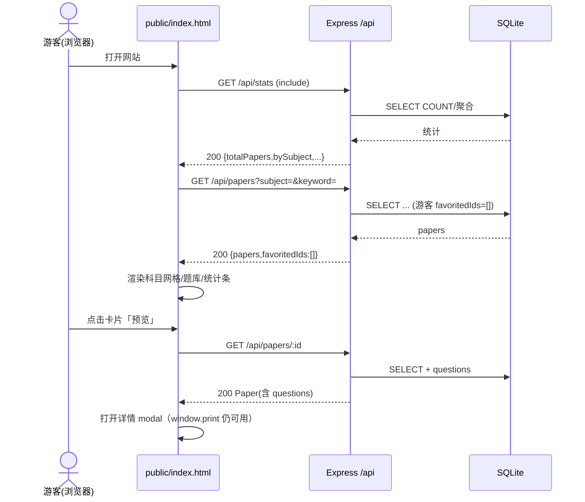
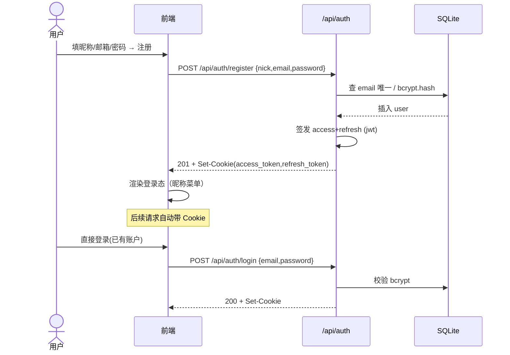
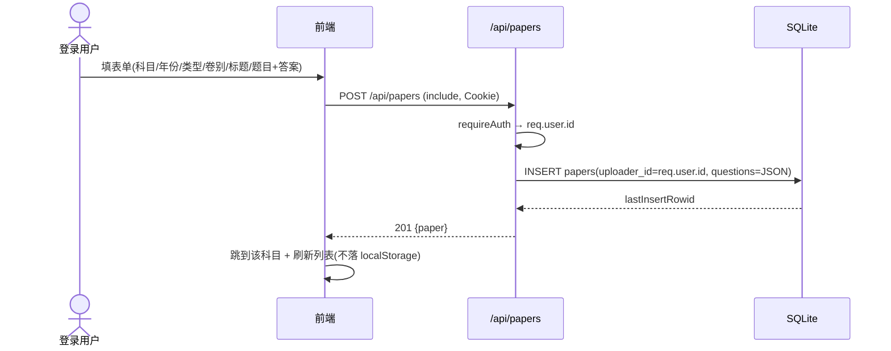
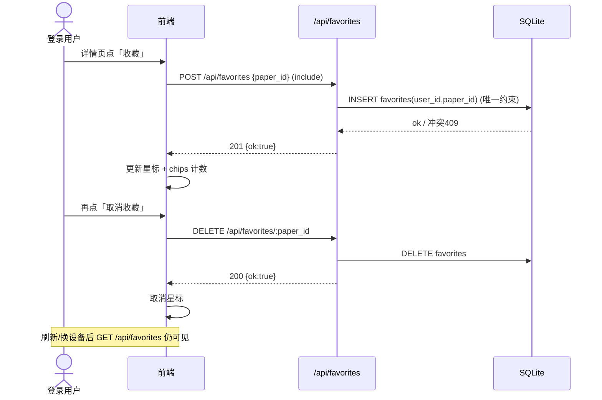
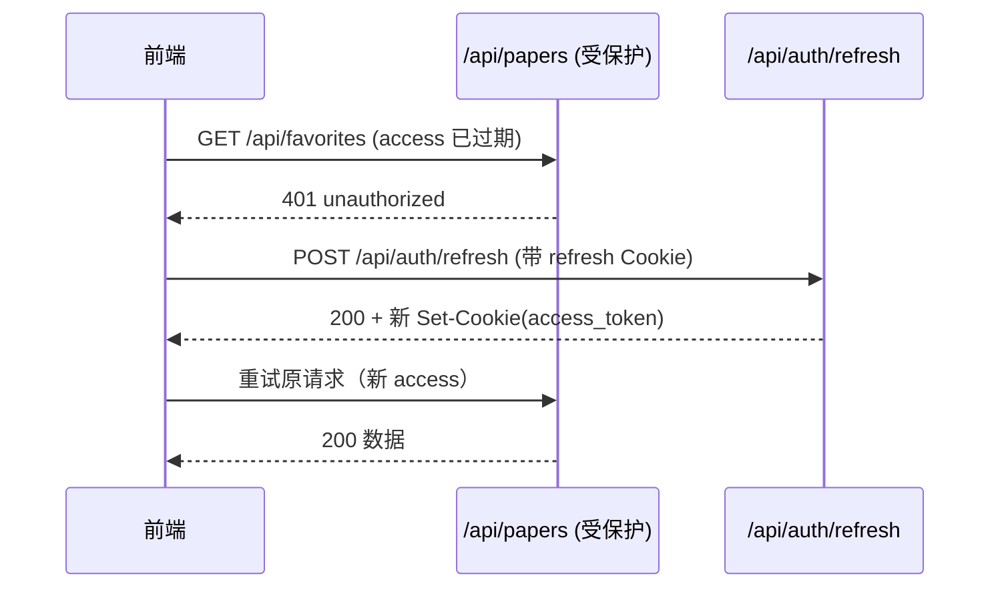

# 答岸 · 全栈化架构设计 + 任务分解（设计文档）

> 角色：架构师「高见远（Gao）」
> 输入：产品经理许清楚的全栈化增量 PRD v1.0 + 现有前端 `答岸.html`
> 技术栈（已定）：Node + Express + SQLite
> 本文件只做**架构设计与任务分解**，不写实现代码（关键处给伪代码/片段示意）

---

## 0. 设计总览（一句话）

把现有「自包含单文件 + localStorage」改造为「Express 托管 `public/` 静态资源 + SQLite 持久化 + JWT(httpOnly Cookie) 鉴权」的全栈应用，**前端只保留矢量视觉与交互，数据全部来自后端 API**。

---

## 1. 实现方案 + 框架选型

### 1.1 运行形态

- **单服务双职责**：`npm start` 启动 Express，既提供 `/api/*` 接口，又用 `express.static('public')` 托管改后的前端。`public/index.html` 成为应用入口，不再双击单文件运行。
- **前后端目录边界**：`server/` 全部服务端逻辑（不出现在浏览器）；`public/` 全部静态资源（HTML/CSS/JS/SVG 内联），浏览器只能访问 `public/` 与 `/api/*`。

### 1.2 依赖选型与理由

| 关注点 | 选型 | 理由 |
|--------|------|------|
| Web 框架 | **Express** | 极简、生态成熟、中间件模型天然契合鉴权/路由；`express.static` 直接托管前端，免单独静态服务器。 |
| SQLite 驱动 | **better-sqlite3**（推荐） | **同步 API**，无需回调/Promise 包裹，代码更直白、易调试；建表/种子脚本可直接顺序执行；性能对本题量级（数百~数千行）绰绰有余。备选 `sqlite3`（异步回调式，样板代码多），不推荐。 |
| JWT 签发/校验 | **jsonwebtoken** | 业界标准，支持 `expiresIn`、自定义 payload（`sub`/`email`）。 |
| 密码哈希 | **bcryptjs** | 纯 JS 实现、零原生编译依赖（比 `bcrypt` 更易在 Windows 安装），满足 PRD 的 bcrypt 哈希要求。 |
| Cookie 解析 | **cookie-parser** | 解析 `Cookie` 请求头，供中间件读取 `access_token`/`refresh_token`。 |
| 环境变量 | **dotenv** | 加载 `.env` 中的 `JWT_SECRET`/`PORT` 等，避免硬编码密钥。 |
| 跨域 | **cors** | 开发期允许前端源（同源部署时其实不需要，但先接上以备前端独立 `vite`/热更调试）；生产期同源可关。 |

> 说明：本期前端由 Express 同源托管，浏览器与 API 同源，`cors` 主要用于「开发期前端若用其它端口/dev server」的场景；同源生产环境可保留中间件但不跨域。

### 1.3 鉴权方案（按主理人裁决）

- **JWT 无状态**，两个 **httpOnly Cookie**：
  - `access_token`：时效 **2h**，携带 `sub=userId / email`，用于受保护接口鉴权。
  - `refresh_token`：时效 **7d**，仅用于 `/api/auth/refresh` 换发新 access。
- Cookie 属性：`HttpOnly; SameSite=Lax; Path=/; Secure`（生产 HTTPS 下 `Secure=true`）。
- 防 XSS：令牌不进 JS 可读的 `localStorage`；前端 `fetch` 用 `credentials:'include'` 自动携带 Cookie。
- **游客可访问**列表/详情/统计；上传/收藏/我的收藏需 `access_token`，缺失或失效 → `401`。

---

## 2. 文件列表（完整项目结构 + 新建/改造标注）

```
答岸-fullstack/
├── package.json                # 【新建】依赖与脚本（start/seed/dev）
├── .env.example                # 【新建】环境变量模板（JWT_SECRET/PORT/JWT_EXPIRES/REFRESH_EXPIRES）
├── .gitignore                  # 【新建】忽略 node_modules、server/data/*.db
├── server/
│   ├── index.js                # 【新建】Express 入口：static 托管、cors、cookie-parser、路由挂载、统一错误处理
│   ├── db.js                   # 【新建】better-sqlite3 连接 + 建表 DDL + 复用句柄导出
│   ├── middleware/
│   │   └── auth.js             # 【新建】verifyToken：读 access_token Cookie → 注入 req.user；可选模式（游客放行）
│   ├── routes/
│   │   ├── auth.js             # 【新建】register/login/logout/refresh
│   │   ├── papers.js           # 【新建】GET 列表 / GET 详情 / POST 上传
│   │   ├── favorites.js        # 【新建】GET 列表 / POST 收藏 / DELETE 取消
│   │   └── stats.js            # 【新建】GET /api/stats 实时聚合
│   ├── seed.js                 # 【新建】将 14 张 BUILTIN_PAPERS 迁移入库（旧字符串 id → 新整数 id）
│   └── data/                   # 【运行时生成】daan.db（gitignore）
└── public/
    ├── index.html              # 【改造自 答岸.html】删除内联 <style>/<script> 与 BUILTIN_PAPERS；仅保留结构 + 内联 SVG；外链 css/js
    ├── css/
    │   └── style.css           # 【拆分自 答岸.html 的 <style> 块】10 色变量、Noto 字体、圆角 14px，原样保留
    └── js/
        └── app.js              # 【重写自 答岸.html 的 <script>】去掉 localStorage + BUILTIN_PAPERS，改为 fetch API + Cookie 自动携带；视觉/交互/事件绑定保留
```

**新建 vs 改造清单**

| 文件 | 性质 | 说明 |
|------|------|------|
| `package.json` `.env.example` `.gitignore` | 新建 | 项目骨架 |
| `server/*` 全部 | 新建 | 服务端 |
| `public/index.html` | 改造 | 抽离样式/脚本、删除内嵌数据 |
| `public/css/style.css` | 拆分 | 原 `<style>` 整块移出 |
| `public/js/app.js` | 重写 | 数据层改 fetch，UI 逻辑基本沿用 |

---

## 3. 数据结构与接口

### 3.1 ER 模型

```
┌─────────────────┐         ┌──────────────────────────────┐         ┌──────────────────┐
│     users       │         │           papers             │         │    favorites     │
├─────────────────┤  1    N ├──────────────────────────────┤  N   1  ├──────────────────┤
│ id PK           │────────▶│ id INTEGER PK AUTOINCREMENT   │◀────────│ id PK            │
│ nick            │         │ subject  TEXT NOT NULL        │         │ user_id FK       │
│ email UNIQUE    │         │ title    TEXT NOT NULL        │         │ paper_id FK      │
│ pwd_hash        │         │ year     INTEGER              │         │ created_at       │
│ created_at      │         │ type     TEXT                 │         │ UNIQUE(user,paper)│
└─────────────────┘         │ volume   TEXT                │         └──────────────────┘
                             │ rate     REAL DEFAULT 0      │
                             │ downloads INTEGER DEFAULT 0  │
                             │ uploader_id INTEGER NULLABLE │──┐
                             │ questions TEXT(JSON) NOT NULL│  │ (官方卷为 NULL)
                             │ source   TEXT DEFAULT 'official' │ (user/official，预留)
                             │ status   TEXT DEFAULT 'approved' │ (审核占位，P2-3)
                             │ created_at TEXT NOT NULL     │
                             └──────────────────────────────┘
```

> 字段以 PRD §3.1 为准，`source`/`status` 为 P2 预留列（本期只写 `'official'`/`'approved'`）。
> `favorites` 收藏状态**不存于 papers 表**，由 `favorites` 表关联推导。

### 3.2 建表 DDL（伪代码）

```sql
CREATE TABLE IF NOT EXISTS users (
  id INTEGER PRIMARY KEY AUTOINCREMENT,
  nick TEXT NOT NULL,
  email TEXT NOT NULL UNIQUE,
  pwd_hash TEXT NOT NULL,
  created_at TEXT NOT NULL DEFAULT (datetime('now'))
);
CREATE TABLE IF NOT EXISTS papers (
  id INTEGER PRIMARY KEY AUTOINCREMENT,
  subject TEXT NOT NULL,
  title TEXT NOT NULL,
  year INTEGER,
  type TEXT,
  volume TEXT,
  rate REAL DEFAULT 0,
  downloads INTEGER DEFAULT 0,
  questions TEXT NOT NULL,            -- JSON 字符串
  uploader_id INTEGER,                -- NULL = 官方内置
  source TEXT DEFAULT 'official',
  status TEXT DEFAULT 'approved',
  created_at TEXT NOT NULL DEFAULT (datetime('now')),
  FOREIGN KEY (uploader_id) REFERENCES users(id)
);
CREATE TABLE IF NOT EXISTS favorites (
  id INTEGER PRIMARY KEY AUTOINCREMENT,
  user_id INTEGER NOT NULL,
  paper_id INTEGER NOT NULL,
  created_at TEXT NOT NULL DEFAULT (datetime('now')),
  UNIQUE (user_id, paper_id),
  FOREIGN KEY (user_id) REFERENCES users(id),
  FOREIGN KEY (paper_id) REFERENCES papers(id)
);
CREATE INDEX IF NOT EXISTS idx_papers_subject ON papers(subject);
```

### 3.3 REST API 表

> 统一约定：受保护接口需浏览器自动带 `access_token` Cookie；统一错误体见 §3.5。

| 方法 | 路径 | 鉴权 | 请求体 / 参数 | 成功响应 | 说明 |
|------|------|------|----------------|----------|------|
| POST | `/api/auth/register` | 游客 | `{nick, email, password}` | `201` + `Set-Cookie(access_token, refresh_token)` + `{user:{id,nick,email,created_at}}` | 邮箱唯一；密码 bcrypt 哈希；自动登录 |
| POST | `/api/auth/login` | 游客 | `{email, password}` | `200` + `Set-Cookie` + `{user}` | 校验失败 → `401` |
| POST | `/api/auth/logout` | 游客 | — | `200 {ok:true}` + 清 Cookie | 清两个 Cookie |
| POST | `/api/auth/refresh` | refresh Cookie | — | `200` + 新 `Set-Cookie(access_token)` + `{user}` | refresh 失效 → `401` |
| GET | `/api/papers` | 游客 | `?subject=&keyword=&page=&pageSize=` | `200 {papers:[Paper], total, page, pageSize, favoritedIds:[...]}` | 合并官方+用户上传；游客 `favoritedIds=[]` |
| GET | `/api/papers/:id` | 游客 | — | `200 Paper(含 questions 解析数组 + uploader)` | 不存在 → `404` |
| POST | `/api/papers` | **登录** | `{subject,title,year,type,volume,questions:[{q,a}]}` | `201 {paper}` | `uploader_id` 取 `req.user.id` |
| GET | `/api/stats` | 游客 | — | `200 {totalPapers,totalSubjects,totalUsers,totalDownloads,bySubject:[{subject,count}]}` | 实时聚合，供统计条/科目网格/筛选 chips |
| GET | `/api/favorites` | **登录** | — | `200 {papers:[Paper]}` | 当前用户收藏列表 |
| POST | `/api/favorites` | **登录** | `{paper_id}` | `201 {ok:true}` | 重复收藏 → `409` |
| DELETE | `/api/favorites/:paper_id` | **登录** | — | `200 {ok:true}` | 未收藏 → `404` |

> `Paper` 响应形态：`{id, subject, title, year, type, volume, rate, downloads, questions:[{q,a}], uploader_id, uploader(昵称或 null), source, created_at, favorited?}`。
> 列表接口在已登录时于返回里附 `favoritedIds`，便于前端标记星标（避免每张卡片多查一次）。

### 3.4 关键片段示意（伪代码）

```js
// middleware/auth.js
function requireAuth(req, res, next){
  const token = req.cookies.access_token;
  if(!token) return res.status(401).json(err('unauthorized','未登录或凭证失效'));
  try { req.user = jwt.verify(token, SECRET); next(); }
  catch { return res.status(401).json(err('unauthorized','登录已过期，请重新登录')); }
}
// 列表接口用的“可选鉴权”
function optionalAuth(req,res,next){ try{ const t=req.cookies.access_token; if(t) req.user=jwt.verify(t,SECRET);}catch{} next(); }

// routes/papers.js (上传)
router.post('/', requireAuth, (req,res)=>{
  const {subject,title,year,type,volume,questions}=req.body;
  if(!title || !subject || !Array.isArray(questions)||!questions.length)
    return res.status(422).json(err('validation_error','标题/科目/题目必填'));
  const info = db.prepare(`INSERT INTO papers(subject,title,year,type,volume,questions,uploader_id,source)
    VALUES(?,?,?,?,?,?,?, 'user')`).run(subject,title,year,type,volume,JSON.stringify(questions),req.user.id);
  const paper = db.prepare('SELECT * FROM papers WHERE id=?').get(info.lastInsertRowid);
  res.status(201).json({paper: withParsedQuestions(paper)});
});
```

### 3.5 统一错误响应体

```json
{ "error": { "code": "string", "message": "string" } }
```

| HTTP | code | message 示例 | 触发 |
|------|------|--------------|------|
| 400 | `bad_request` | 请求格式错误 | 路由/参数无法解析 |
| 401 | `unauthorized` | 未登录或凭证失效 | 缺 token / 过期 / refresh 失效 |
| 409 | `conflict` | 该邮箱已被注册 / 已收藏 | 邮箱重复 / 重复收藏 |
| 422 | `validation_error` | 密码至少 6 位 / 标题必填 | 字段校验失败 |
| 404 | `not_found` | 试卷不存在 / 未收藏 | 资源缺失 |
| 500 | `internal_error` | 服务器内部错误 | 未捕获异常（不泄露堆栈） |

> 服务入口用 `app.use((err,req,res,next)=> res.status(err.status||500).json(err('internal_error', err.message||'服务器错误')))` 兜底。

---

## 4. 程序调用流程（时序图 · Mermaid）

### 4.1 游客浏览 + 预览



### 4.2 注册 → 登录拿到 Cookie



### 4.3 登录后上传试卷



### 4.4 登录后收藏 / 取消



### 4.5 补充：access 过期 → refresh 静默续期



---

## 5. 任务列表（有序 · 含依赖 · 按实现顺序）

> 每个任务标注：依赖（前置）、产出文件、验收要点。

| ID | 任务 | 依赖 | 产出文件 | 要点 |
|----|------|------|----------|------|
| **T1** | 初始化项目骨架与依赖 | — | `package.json` `.env.example` `.gitignore` | `npm init`；装 express/better-sqlite3/jsonwebtoken/bcryptjs/cookie-parser/dotenv/cors；脚本 `start`/`seed`/`dev`；`.env.example` 含 `JWT_SECRET`/`PORT=3000`/`ACCESS_EXPIRES=2h`/`REFRESH_EXPIRES=7d` |
| **T2** | 建库与建表模块 | T1 | `server/db.js` | better-sqlite3 连接（路径 `server/data/daan.db`）；导出 `db` 句柄；启动时 `CREATE TABLE IF NOT EXISTS`（见 §3.2） |
| **T3** | 鉴权中间件 + auth 路由 | T2 | `server/middleware/auth.js` `server/routes/auth.js` | `requireAuth`/`optionalAuth`；register/login（bcrypt.compare + 签发双 token + Set-Cookie）、logout（清 Cookie）、refresh（验 refresh → 发新 access）；邮箱唯一/密码长度校验 |
| **T4** | 试卷路由 | T2,T3 | `server/routes/papers.js` | `GET /api/papers`（可选鉴权，过滤 `subject`/`keyword`/`page`，返回 `favoritedIds`）、`GET /api/papers/:id`、`POST /api/papers`（requireAuth，questions 数组→JSON 入库） |
| **T5** | 收藏路由 | T2,T3 | `server/routes/favorites.js` | `GET/POST/DELETE`，UNIQUE 约束防重复（`409`），`DELETE` 未命中 `404` |
| **T6** | 统计路由 | T2 | `server/routes/stats.js` | `GET /api/stats` 实时聚合（收录数/科目数/用户数/下载总量 + bySubject） |
| **T7** | Express 入口 + 路由挂载 | T3,T4,T5,T6 | `server/index.js` | `express.static('public')`；`cors`；`cookieParser`；`/api/auth|papers|favorites|stats` 挂载；统一错误中间件；`PORT` 监听 |
| **T8** | 种子脚本（14 张迁移） | T2 | `server/seed.js` | 内嵌 `BUILTIN_PAPERS`（从原前端抽取）；`b1..b14` → 整数 `1..14` 映射；`questions` 转 JSON 字符串入库；`uploader_id=NULL`、`source='official'`；`npm run seed` 幂等（先清后插或 `INSERT OR IGNORE`） |
| **T9** | 前端改造（去内嵌数据/localStorage） | T7,T8 | `public/index.html` `public/css/style.css` `public/js/app.js` | index.html 抽离样式/脚本、删 `BUILTIN_PAPERS`；style.css 原样搬；app.js：删 localStorage/`allPapers`/`daan_users` 等，改 `fetch('/api/...',{credentials:'include'})`；列表/详情/上传/收藏/统计全部走 API；视觉/导航/抽屉/modal/打印/交互保留 |
| **T10** | 联调与统一错误/加载态 | T9 | （无新文件，改 app.js/index.js） | 401 自动 refresh 或引导登录；toast/空态/加载态；字段对齐（见 §7）；浏览器自测游客浏览/注册登录/上传/收藏/换设备 |
| **T11**（可选） | 部署/Docker 说明 | T7 | `Dockerfile` `README`(P2) | 挂载 `server/data/daan.db`、环境变量；属 P2，可后置 |

> 推荐实现顺序：T1→T2→T3→T4→T5→T6→T7→T8→T9→T10；T11 视排期后置。

---

## 6. 依赖包列表

| 包 | 用途 | 运行/开发 |
|----|------|-----------|
| `express` | Web 框架 + 静态托管 | 运行 |
| `better-sqlite3` | SQLite 同步驱动（建表/查询/种子） | 运行 |
| `jsonwebtoken` | 签发/校验 JWT（access/refresh） | 运行 |
| `bcryptjs` | 密码哈希与校验 | 运行 |
| `cookie-parser` | 解析请求 Cookie（读 token） | 运行 |
| `dotenv` | 加载 `.env` 环境变量 | 运行 |
| `cors` | 开发期跨域（前端独立端口时） | 运行 |
| `nodemon`（可选） | `npm run dev` 热重启 | 开发 |

> 无前端构建工具：保持原生 HTML/CSS/JS，零打包，契合「矢量风格自包含」精神。

---

## 7. 共享知识（跨文件约定）

### 7.1 Cookie 名称与属性
- `access_token`：HttpOnly，`Max-Age=7200`（2h），`Path=/`，`SameSite=Lax`，生产 `Secure`。
- `refresh_token`：HttpOnly，`Max-Age=604800`（7d），其余同上。
- 前端**永不**用 JS 读取这两个 Cookie（防 XSS 窃取）。

### 7.2 questions 存储约定
- 入库：`JSON.stringify(questions)` 存 `papers.questions`（TEXT）。
- 出库：路由层 `JSON.parse` 后随 Paper 返回；前端直接当 `[{q,a}]` 用。
- 种子/上传均遵守此约定。

### 7.3 fetch 默认约定
- 所有 API 请求：`fetch(url, { method, headers:{'Content-Type':'application/json'}, body: JSON.stringify(x), credentials:'include' })`。
- `credentials:'include'` 保证同源/跨域都自动带 Cookie。

### 7.4 Paper 字段对齐表（前端 ↔ API）

| 前端字段 | API 响应字段 | 备注 |
|----------|--------------|------|
| `id` | `id` | 整数（原 `b1`/`u+时间戳` 退役） |
| `subject` | `subject` | 同 |
| `title` | `title` | 同 |
| `year` | `year` | 同 |
| `type` | `type` | 同 |
| `volume` | `volume` | 同 |
| `rate` | `rate` | 同（保留展示，本期不写评分） |
| `downloads` | `downloads` | 同 |
| `questions` | `questions` | 数组 `[{q,a}]`（API 已 parse） |
| `uploader` | `uploader`（昵称） | 官方卷为 `null`；前端详情页展示「上传者·昵称」 |
| `favorites` | 列表用 `favoritedIds` 推导；收藏页直接来自 `/api/favorites` | 不再存于 Paper 对象本身 |
| — | `uploader_id`/`source`/`created_at` | 前端一般不直接用，预留 |

> 前端改造时：`renderPapers` 接收后端 `papers` 数组；`favSet` 改为 `Set(favoritedIds)`（列表）或 `GET /api/favorites` 结果集（收藏页）；`openDetail(id)` 改为先 `fetch('/api/papers/'+id)`。

### 7.5 错误码表（前端 switch 依据）

| code | 前端处理 |
|------|----------|
| `unauthorized` | 清本地登录态、toast「请登录」、打开登录 modal（或在触发接口前引导） |
| `conflict` | toast「邮箱已注册 / 已收藏」 |
| `validation_error` | 表单内联提示 / toast 具体 message |
| `not_found` | toast「试卷不存在」并刷新列表 |
| `bad_request` / `internal_error` | toast 通用错误，控制台记日志 |

### 7.6 种子 id 映射（关键）
- `b1→1, b2→2, ..., b14→14`（按 `BUILTIN_PAPERS` 数组顺序）。
- `uploader_id = NULL`，`source = 'official'`。
- 用户上传为整数自增 id（≥15），`uploader_id` = 当前用户 id。

---

## 8. 待明确事项（仅剩非阻塞项）

1. **refresh 旋转策略细节**（P1-2）：本期采用「access 过期 → 前端捕获 401 → 调 `/refresh` 换新 access → 重试原请求」的**被动刷新**；是否做「refresh 也滚动续期（每次 refresh 换发新 refresh）」留待联调时定，建议被动刷新即可，降低复杂度。
2. **分页边界**（P2-2 / P0-5）：`GET /api/papers` 已支持 `page`/`pageSize`，默认 `pageSize=30`；前端本期是否真正分页渲染（还是一次取全量）由 T9 视体验定，后端已具备能力。
3. **Dockerfile / 部署说明**（P2-1）：属 P2，T11 后置；需明确是否要 `docker-compose` 挂载 `server/data`。
4. **`status` 审核钩子**（P2-3）：仅预留列与字段，本期所有上传直接 `approved`，不实现审核流。
5. **下载量 `downloads` 是否真实自增**：本期详情接口被调用时不强制 `+1`（避免刷量），统计条的「年均下载」沿用种子值聚合；若需真实计数，T10 联调时再决定是否在详情接口对官方卷计一次。
6. **CORS 生产收紧**：同源部署时 `cors` 可关闭；若后续前端用 CDN/独立域名，再配 `origin` 白名单。

---

## 9. 关键架构决策摘要（供主理人速览）

- **SQLite 驱动选 `better-sqlite3`**：同步 API，建表/种子/查询代码最简，Windows 安装无原生编译坑（配合 `bcryptjs` 同样零原生依赖）。
- **鉴权 = JWT + 双 httpOnly Cookie**（access 2h / refresh 7d）：无状态、防 XSS、多端复用简单。
- **前端改造原则**：删 `BUILTIN_PAPERS` 与全部 localStorage；视觉/交互/内联 SVG/10 色变量/Noto 字体/圆角 14px 原样保留；数据层全量切 `fetch` + `credentials:'include'`。
- **试卷主键改整数自增**，`seed.js` 负责 `b1..b14 → 1..14` 映射；收藏/上传均用整数 id。
- **统一错误体** `{error:{code,message}}`，401 触发前端 refresh 或引导登录。
- **统计后端化**：`/api/stats` 实时聚合，替代前端 `allPapers().length`。

> 设计文件结束。下一步由开发按 T1→T10 顺序实现；T11（Docker/P2）视排期。
